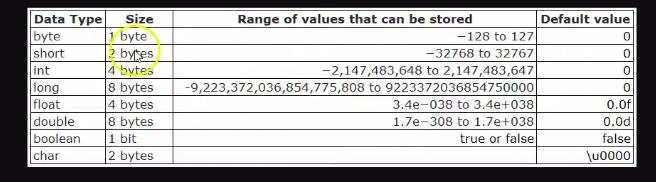

# Declaração e Tamanho em Memória

[DeclaracaoETamanhoEmMemoria03.java](../maratona-java/src/me/kevensouza/maratonajava/intro/DeclaracaoETamanhoEmMemoria03.java)

```java
  public class DeclaracaoETamanhoEmMemoria03 {
    public static void main(String[] args) {
        // int, double, float, char, byte, short, long, boolean

        int idade = 20;
        byte idadeByte = 30;
        short idadeShort = 32;

        long frustracoes = 98389219;

        float salarioFloat = 2500;
        double salarioDouble = 3000;

        boolean dev = true;

        char primeiraLetraDoNome = 'k';
    }
}
```

Com exceção do tipo `boolean`, o tipo de todas as variáveis declaradas acima são numéricos, até mesmo o `char`.
<br/>
O que os diferencia é o tamanho em memória que eles podem ocupar.

### Abaixo, uma imagem onde podemos ver `o valor que cada tipo pode armazenar`, `seu tamanho em memória` e `o seu valor padrão`



1 byte é o equivalente a 8 bits.
<br/>
Os bits só podem armazenar os valores `1` ou `0`. Abstraido também para `true` or `false`. Por isso o tipo `boolean` só ocupa `1 bit`, ele não precisa de mais que isso.

Também podemos ver que o tipo `byte` ocupa justamente 1 `byte`, que pode armazenar um range de valor em base decimal entre **-128** a **127**

----------


### Mas, por quê 1 byte não pode armazenar 128, já que convertido para binário seria 1111 1111, ocupando justo 8 bits?

a lógica é um pouco diferente na prática, um dos bits são usados para informar que o valor é positivo, desta forma, quando o tipo `byte` armazena um numero positivo, ele está usando 1 bit para informar que é positivo, por isso também, o range abrange o valor negativo `-128`, porque não está sendo usado 1 bit pra informar que é um valor positivo.

----------

Resumidamente, `byte, short, int, long` armazenam **Inteiros**, `float, double` para **Decimais**, `boolean` para **veradeiro ou falso**, e `char` para **Caractéres**, a princípio o tipo `char` só usaria um único byte na memória, mas os caracteres asiáticos, por exemplo, acabam sendo "muito" ocuposos. 

Outra "peculiaridade" do tipo `char`, é que, embora seja um tipo numério, mesmo projetado para armazenar um caractere, ele nem sempre exibirá números, pois é configurado com base no padrão **ASCII**, ou seja, se armazenamos um número inteiro de base decimal, ele fará a `conversão` desse número e retornará o respectivo valor de acordo com a `tabela ASCI`, um exemplo, se nos armazenassemos o número 65, ele nos retorna A:
<br/>
(também é possível passar um valor unicode). sintaxe ex: `char unicode = '\u0042';`

```java
  char example = 65;

  System.out.println("example: " + example);
```

```
example: 65
```

Tabela ASCII

