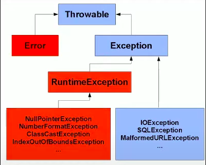
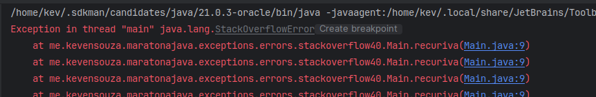

# Errors

Até então trablhamos com o fluxo perfeito, onde tudo dá certo, mas é necessário entender sobre o lado negro da força... O lado onde tudo da errado.

Assim como tudo no Java é herança da classe `Object`, todas as exceções no Java pertencem a classe `Throwable`, que também pertence a classe `Objeto`.

----------

Em geral, duas classes herdam a classe `Throwable`, são essas a classe `Error` e a classe `Exception`...



Exceções são a grande maioria... então vamos falar dos Errors.

### O que são

Errors são as situações das quais não tem como se recuperar.
<br>
Um exemplo: *Imagine que sua memória simplesmente acaba enquanto seu projeto está rodando, isso resulta num lançamento de erro `OutOfMemoryError`*

Esse tipo de erro não tem como ser corrigido em tempo de execução, o máximo que você poderia fazer é corrigir o problema, restartar e torcer pra que não persista...

Um exemplo de erro é o StackOverFlow que pode ser traduzido em estouro de fluxo de empilhamento, a stack seria chamadas de métodos, quando temos um método recursivo que não tem previsão de parar, por exemplo, automáticamente é lançado um erro de StackOverFlow

Exemplo:

[StackOverFlow](../maratona-java/src/me/kevensouza/maratonajava/exceptions/errors/stackoverflow40/Main.java)

```java
public class Main {
    public static void main(String[] args) {
        recuriva();
    }

    public static void recuriva() {
        recuriva();
    }
}
```



### Moral da Hisória

Error é o tipo de problema que você não consegue resolver em tempo de execução, até porque no momento em que é lançado, a aplicação já não estará mais de pé.