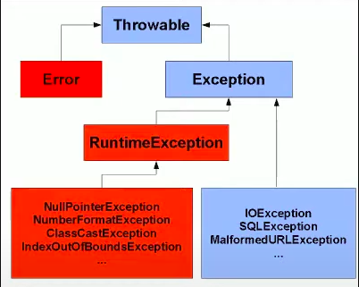

# runtimeException

[Runtime Excpetion](../maratona-java/src/me/kevensouza/maratonajava/exceptions/runtimeexception41/Main.java)

Vamos deixar os Errors de lado por enquanto e falar especificamente das Excepions, de acordo com a imagem abaixo, é possível ver dois tipos diferentes de exceptions, que são os filhos da classe `Exception` e os da classe `RuntimeException`

Chamamos de `Checked Exceptions` as que são filhas da classe Exception e necessáriamente precisam ser tratadas para que o programa compile e seja executado, enquanto as `Unckecked Exceptions` que são filhas da classe RuntimeException, não necessáriamente precisam ser tratadas para compilar e executar o programa.

### Checked

Ckecked Exceptions não permitem que o código seja compilado.

### Unchecked

Quando lançadas pelo próprio programa, quase 100% das vezes são causadas por erro humano no código, um exemplo é o `NullPointerException`, lançado quando se tenta acessar um objeto inexistente na memória. Em contrapartida, RuntimeExcpetions também podem ser lançadas propositalmente pelo desenvolvedor.