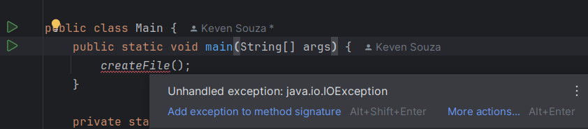

# Exception

[Exception](../maratona-java/src/me/kevensouza/maratonajava/exceptions/exception42/Main.java)

Vamo ver como funciona o lançamento de uma exceção, usando como exemplo a `IOException`, que é uma Unchecked/RuntimeException.

importando as classes `java.io.file` e `java.io.IOException` e chamando o método **createFile()** no método main.

```java
import java.io.File;
import java.io.IOException;

public class Main {
    public static void main(String[] args) {
        createFile();
    }
}
```

agora, observamos no código abaixo uma tratativa de exceção com Try Catch:

```java
    private static void createFile() {
        // cria uma nova instância da classe File, passando o caminho e o nome do arquivo como argumento do construtor
        File file = new File("pasta/file.txt");

        try {
            // guarda um valor booleano quanto à criação do arquivo
            boolean isCreatedFile = file.createNewFile();
            // printa "is created file: True" caso o arquivo tenha sido criado com êxito
            System.out.println("is created file: " + isCreatedFile);
        } catch (IOException e) {
            // retorna informações da IOException caso o arquivo não possa ser cria do ela seja lançada
            e.printStackTrace();
        }
    }
```

### O que acontece no bloco Try Catch acima?

1. o método createNewFile() é executado para a criação do arquivo
2. caso o arquivo não seja criado o bloco de código pula a linha do `SOUT` e em seguida executa o método printStackTrace() da variável `e` que corresponde à IOException

----------

Pra usar o IOException dentro do Catch, é necessário ter um método no Try que permite lançar essa exceção.
<br>
Como por exemplo o método `createNewFile()`


```java
public boolean createNewFile() throws IOException {
    //...
}
```

----------

Um detalhe importante é não deixar o bloco Catch vazio, pois não faz o mínimo sentido usar o Try Catch e não lançar a exceção caso ela aconteça.

### Outros Casos de Exceção

No exemplo acima usamos a IOException, mas pode ser diferente em outras situações, por isso, é importante saber que...
<br>
**`É possível lançar uma nova exceção ou relançar uma exceção`**

No mesmo exemplo de arquivos podemos lançar uma nova RuntimeException dessa forma:

```java
        catch (IOException e) {
            e.printStackTrace();
      --->  throw new RuntimeException("Error creating file", e);
        }
```

E podemos relançar a exceção IOException dessa forma:

```java
        catch (IOException e) {
            e.printStackTrace();
       -->  throw new IOException("Error creating file", e);
        }
```

Mas quanto ao exemplo acima de relançamento de uma Exceção com Throw, precisamos saber qual o propósito dessa prática...
<br>
Quando relançamos uma exceção com throw queremos que a responsabilidade de tratamento seja passada para a classe/método que está chamando este método/classe, por isso precisamos adicionar a seguinte linha de código para passar essa responsabilidade:

```java
// dessa forma o método que está chamando createFile() estará ciente que o método pode lançar uma IOException. No nosso caso, a responsabilidade está indo para o método main...
private static void createFile() throws IOException
```



Agora cabe a nós tratar essa exceção ou passar a batata quente (responsabilidade) para o método mais próximo da JVM (não recomendado)

Embora seja possível colocar o `throws IOException` no método main, isso não é recomendado, pois você estará praticamente ignorando a exceção e mandando pra JVM, quando chegar à JVM o app sera quebrado.

### Recomendado

O recomendado seria tratar a exceção o mais longe possível da JVM. Como assim?
<br>
No nosso exemoplo, o ideal seria tratar a exceção no próprio método local `createFile()` 