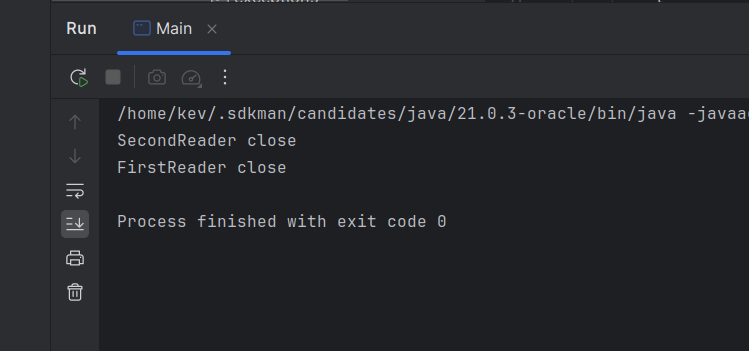

# Try With Resources

Vamos usar um exemplo da utilidade do Try com Resources com uma função de ler arquivos...
<br>
Pra ler um arquivo com java, é necessário a importação de alguns pacotes

- java.io.reader
- java.io.BufferedReader
- java.io.FileReader

O método FileReader pode lançar uma `FileNotFoundException`, o que nos faz encapsulá-lo em um Try Catch, dessa forma:

```java
        Reader reader = null;

        try {
            reader = new BufferedReader(new FileReader("file.txt"));
        } catch (FileNotFoundException e) {
            throw new RuntimeException(e);
        }
```

Tem mais um detalhe, quando terminamos de ler um arquivo, precisamos fechá-lo, e esse tipo de método é chamado no bloco Finally, dessa forma:

```java
        // declarado fora do escopo da captura para poder chamar o método close()
        Reader reader = null;

        try {
            reader = new BufferedReader(new FileReader("file.txt"));
        } catch (FileNotFoundException e) {
            throw new RuntimeException(e);
        } finally {
            reader.close();
        }
```

...Porém, o método close() pode lançar uma `IOException`, o que nos faz encapsular o método em uma captura... o que deixa o código bem ilegível, assim:

```java
    public static void wrongReadFile() {
        Reader reader = null;

        try {
            reader = new BufferedReader(new FileReader("file.txt"));
        } catch (FileNotFoundException e) {
            throw new RuntimeException(e);
        } finally {
            try {
                if (reader != null) reader.close();
            } catch (IOException e) {
                throw new RuntimeException(e);
            }
        }
    }
```

### Try With Resources

[text](../maratona-java/src/me/kevensouza/maratonajava/exceptions/TryWithResources43/)

Esse recurso nos permite declarar e exceutar dentro do parâmetro do Try, o que pode deixar nosso código mais simples, dessa forma:

```java
    public static void correctReadFile() {
        try (
                FirstReader fReader = new FirstReader();
                SecondReader sReader = new SecondReader();
        ) {

        } catch (IOException e) {
            throw new RuntimeException(e);
        }
    }
```
Basta definir a lógica as `classes Reader`, implementar a interface Closeable e sobrescrever o método `close()`, dessa forma a responsabilidade de fechar o arquivo será passada e executada pelo método `close()` automáticamente:

```java
public class FirstReader implements Closeable {
    
    //...   
    
    @Override
    public void close() throws IOException {
        System.out.println("FirstReader close");
    }
}
```

Executando o código é possível ver a execução dos métodos `close()`:

