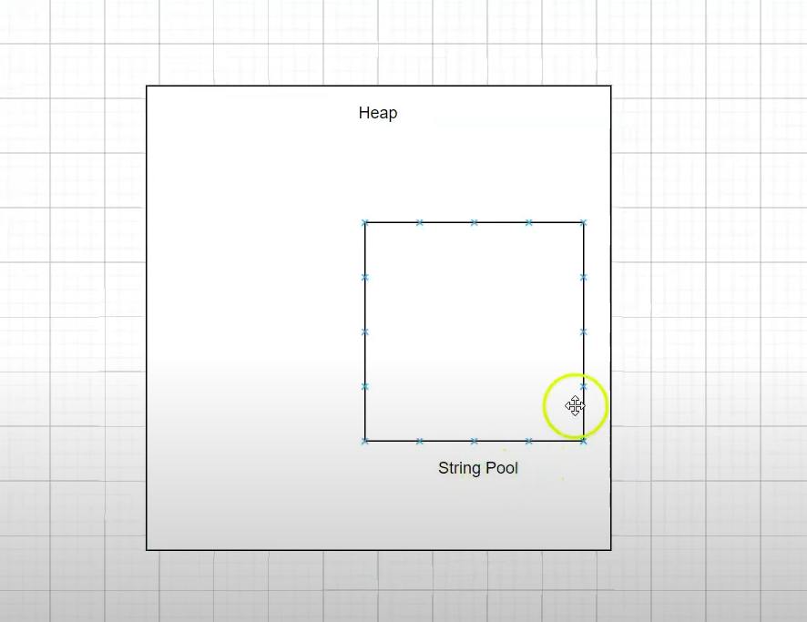

# Strings

[String45](../maratona-java/src/me/kevensouza/maratonajava/utilitaries/strings45/)

### Sempre usamos Strings no java, mas como realmente funcionam?

#### quando atribuimos um valor a um atributo String, na verdade, estamos criando uma `String constant pool` ou `Piscina constante de string`.

Podemos imaginar da seguinte forma:

- Um grande espaço na memória, que chamamos de Heap (`amontoado`)
- E um pequeno espaço no Heap dedicado às strings, que seria a `Piscina de Strings`



Conhecemos dessa forma, porquê existe um conceito na Ciência da Computação, chamado String Interning, que basicamente é, quando usamos string de forma imutável. Ou seja, no java, toda string criada vai ter seu valor alocado na `String Pool`, mas quando criamos outra variável com o mesmo valor, não terá outro valor alocado na Pool; mas sim um direcionamento ao valor já existente. Exemplo:

```java
    // aloca o valor "Keven" na Pool e aponta a variável {nome} para endereço que "Keven" está alocado.
    String nome = "Keven";

    // apenas aponta a variável {nome2} para o endereço onde "Keven" está alocado.
    String nome2 = "Keven";
```

## Diferença entre comparar Strings com == e com o método equals()

Quando usamos `==` para comparar Strings, é levado em consideração o local onde o valor está alocado, se duas variáveis fazem a mesma referência à String Pool o retorno sera `true`, mas caso seja comparado com uma instância da classe String será falso, pois uma instância da classe String é um objeto como todas outras instâncias, logo não será alocado na String Pool.

Enquanto o método `equals()`, à princípio só levará em consideração o valor da variável. Logo retornará true caso seja comparado uma instância da classe String e uma String literal da seguinte forma:

```java
    String nome1 = "Keven";
    String nome2 = new String("Keven");

    // true
    nome1.equals(nome2);
```

### Demonstração:

```java
public class Main {
    public static void main(String[] args) {
        // aloca o valor "Keven" na String Constant Pool e aponta a variável {nome1} para o endereço da memória que "Keven" está alocado.
        String nome1 = "Keven";
        // aponta a variável {nome2} para o endereço onde "Keven" já está alocado na String Pool
        String nome2 = "Keven";

        // faz referência para o mesmo endereço na memória? Sim
        System.out.println(nome1 == nome2);

        // aloca os valores " Runner" e "Keven Runner" na String Pool, a variável {nome1} passa a fazer referência à esse local na memória
        nome1 = nome1.concat(" Runner");
        System.out.println("novo valor para nome1: " + nome1);

        // dessa forma é alocado um novo valor "Keven" no Heap, porém fora da String Constant Pool, pois isso não é uma string literal, mas sim um objeto.
        String nome3 = new String("Keven");

        // faz referência para o mesmo endereço na memória? Não pois nome3 está fora da String Constant Pool
        System.out.println(nome2 == nome3);

        // o valor de nome2 é igual ao de nome3, ignorando o local na memória? Sim
        System.out.println(nome2.equals(nome3));
    }
}
```