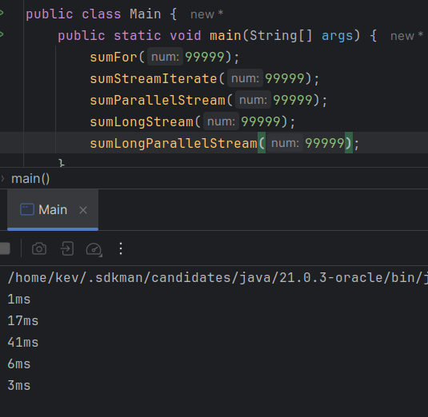

# Streams

[Streams](../maratona-java/src/me/kevensouza/maratonajava/streams/)

Uma das melhores, senão a melhor funcionalidade implementada ao Java desde a versão 8.
<br>
Stream basicamente é uma forma de processamento de dados que ajuda você a fazer as funcionalidade que você precisa em uma coleção de forma mais funcional/declarativa. É muito parecido com a forma que se faz com banco de dados... filtrar uma coleção de mangas por nome, pegar os mangas que tem mais de x letras...

Pra exemplificar seu uso, vamos usar este pequeno Exemplo:

Imagine que você tem uma classe chamada LightNovel (são chamados assim os livros que dão origem aos animes), onde temos os seguintes atributos:

```java
    public class LightNovel {
        private String title;
        private Double price;
    }
```

Temos as seguintes tarefas pra fazer em cima dessa classe...

1. Ordenar os objetos por título.
2. retornar os 3 primeiros objetos onde o preço seja menor que 5.00.

vamos ver como podemos fazer isso com e sem o uso de `Streams`:

### Sem Streams

[Sem Streams](../maratona-java/src/me/kevensouza/maratonajava/streams/LightNovel80/semStream/Main.java)

```java
        // 1 - order by alphabetical
        lightNovels.sort((a, b) -> a.getTitle().compareTo(b.getTitle()));

        // 2 - retrieve the first three light novels with price less or equal than 70
        List<LightNovel> filteredLightNovel = new ArrayList<>();
        lightNovels.forEach((lightNovel) -> {
            if (lightNovel.getPrice() <= 70 && filteredLightNovel.size() < 3) {
                filteredLightNovel.add(lightNovel);
            }
        });

        filteredLightNovel.forEach(System.out::println);
```

### Com Streams

[Sem Streams](../maratona-java/src/me/kevensouza/maratonajava/streams/LightNovel80/comStream/Main.java)

```java
        lightNovels.stream()
                // 1 - order by alphabetical
                .sorted((a, b) -> a.getTitle().compareTo(b.getTitle()))
                // 2 - retrieve the first three light novels with price less or equal than 70
                .filter(lightNovel -> lightNovel.getPrice() <= 70)
                .limit(3)
                .forEach(System.out::println);
```

## Métodos Stream

A Stream API tem outros métodos cujo são considerados geralmente como métodos `intermediários`, `finais` ou `estáticos`, onde **intermediários** são os que retornam um novo Stream, permitindo o encadeamento de operações. Métodos *intermediários* não consomem a Stream original, somente transformam ou filtram os dados para que sejam processados posteriormente. são exemplos de métodos intermediários da Stream API:

- filter()
- map()
- flatMap()
- distinct()
- sorted()
- etc...

Os métodos **finais** são justamente os métodos que consomem a Stream e retornam um resultado final das operações usadas. Exemplos:

- forEach()
- collect()
- reduce()
- toArray()
- count()
- etc...

E por final, os métodos estáticos da classe Stream, que são usados para criar streams...

- Stream.of()
- Stream.iterate()
- Stream.generate()
- Stream.concat()

----------

A seguir veremos exemplos sobre alguns dos métodos Stream.

### FlatMap

`FlatMap` é um intermediário faz a mesma coisa que o `Map` faz (recebe um método (geralmente anônimo) como argumento para aplicar para cada elemento de uma coleção, por exemplo), com a seguinte diferença: o `FlatMap()` tem a funcionalidade de aninhar/achatar a coleção passada. Exemplo:

Imagine que você tem uma Lista de Listas (como um array multidimensional) de Strings e deseja aplicar um determinado método para cada uma das strings de todas essas listas.

como fariamos sem Stream() e sem flatMap()

```java
        for (List<String> strings : stringsLists) {
            for (String subStrings : strings) {
                System.out.println(subStrings.toLowerCase());
            }
        }
```

Como fazemos com FlatMap()

```java
        stringsLists.stream()
                // retornará uma Stream<String> para o forEach() || o que seria diferente se usassemos o map(), pois retornaria Stream<Stream<String>>
                .flatMap(Collection::stream)
                .forEach(s -> System.out.println(s.toLowerCase()));
```

### Reduce

Um método terminal da Stream API, que possibilita a obtenção de um único resultado a partir de uma sequencia/coleção de elementos, como por exemplo: *somando todos os números de uma lista de inteiros*

```java
        numbers.stream()
            .reduce(Integer::sum)
            .ifPresent(System.out::println);
```

## Gerando Streams

Até o momento só foram usados Streams sob coleçẽs, e essas são as outras formas de inicializar um Stream:

Stream usado pra manter os valores primitivos:

**IntStream**
**DoubleStream**

```java
    // example (0, 50) -> 0 - 49 (excluisve)
    IntStream.range();
    // example (0, 50) -> 0 - 50 (inclusive)
    IntStream.rangeClosed();
```

----------

**Stream.of()**

```java
    // recebe um VarArgs de <T> (qualquer coisa)
    Stream.of();
```

----------

**Arrays.stream()**

```java
    int[] nums = {0, 1, 2, 3, 4, 5};
    Arrays.stream(nums).average().ifPresent(System.out::println);
```

## Collectors

É um framework da Stream API onde facilita os próprios métodos da Stream API como também extende o seu repertório de funcionalidades com alguns métodos interessantes, como por exemplo:

Summarizing()
```java
        // cria estatísticas baseadas numa coleção de dados, nesse exemplo foram usados os preços dos objs LightNovel.
        DoubleSummaryStatistics summaryStatistics = lightNovels.stream().collect(Collectors.summarizingDouble(LightNovel::getPrice));
        System.out.println(summaryStatistics);
```

Joining()
```java
        // cria formatação de texto com delimitador, a sáida desse código será uma lista de todos os títulos de LightNovels da coleção delimitado por ", ".
        String titlesJoining = lightNovels.stream().map(LightNovel::getTitle).collect(Collectors.joining(", "));
        System.out.println(titlesJoining);
```

### Grouping By

Agora sobre Agrupamentos, ainda na parte de Collectors.

Vamos Agrupar objetos por categorias. Temos as seguintes categorias de Light Novels (drama, fantasia e romance) e para cada categoria devemos ter uma Lista com os respectivos Light Novels.

#### Sem o uso de Streams

```java
        Map<Category, List<LightNovel>> groupByCategory = new HashMap<>();

        // without streams
        List<LightNovel> fantasyLightNovels = new ArrayList<>();
        List<LightNovel> dramaLightNovels = new ArrayList<>();
        List<LightNovel> romanceLightNovels = new ArrayList<>();

        // caso seja adicionada uma nova categoria, a seleção dos respectivos objetos terão que ser manualmente implementadas.

        for (LightNovel lightNovel : lightNovels) {
            switch (lightNovel.getCategory()) {
                case FANTASY:
                    fantasyLightNovels.add(lightNovel);
                    break;

                case DRAMA:
                    dramaLightNovels.add(lightNovel);
                    break;

                case ROMANCE:
                    romanceLightNovels.add(lightNovel);
                    break;
            }
        }

        groupByCategory.put(Category.FANTASY, fantasyLightNovels);
        groupByCategory.put(Category.DRAMA, dramaLightNovels);
        groupByCategory.put(Category.ROMANCE, romanceLightNovels);
```

#### Com Streams

```java
    private static void groupWithStreams(Map<Category, List<LightNovel>> groupByCategory) {
        groupByCategory = lightNovels.stream().collect(Collectors.groupingBy(LightNovel::getCategory));
    }
```

## Streams paralelas

Uma forma interessante de aproveitar as Threads da máquina é usando o paralelismo ao nosso favor. A partir de agora vamos ver como o Java conseguiu abstrair a complexidade de desenvolver códigos que rodam de forma paralelas.

Usando o método `getRuntime()` da classe `Runtime` é possível acessar algumas informações da máquina qual está sendo rodado o nosso projeto Java. Como: `free | max | total - Memory()`, `availableProcessors()`, etc...

Rodando o método `Runtime.getRuntime().availableProcessors()`, podemos ver quantas threads da máquina estão disponíveis

----------

Ok, vamos começar por um exemplo de onde não se deve usar streams paralelas:

temos 3 métodos, cujo objetivo somar dois números que iniciam em 0, um desses números seria um "marcador de iteração", enquanto o outro é um atributo de tipo long do método.

cada método tem um diferencial

1. usa for
2. usa Stream Iterate
3. também usa Stream Iterate, mas com o método Parallel() que faz com que seja usado mais de uma thread (se possível).

```java
    private static void sumFor(long num) {
        long res = 0;

        long init = System.currentTimeMillis();
        for (long i = 0; i <= num; i++) {
            res += i;
        }
        long end = System.currentTimeMillis();

        System.out.println((end - init) + "ms");
    }
```

```java
    private static void sumStreamIterate(long num) {
        long res = 0;

        long init = System.currentTimeMillis();
        Stream.iterate(1l, i -> i += 1).limit(num).reduce(0L, Long::sum);
        long end = System.currentTimeMillis();

        System.out.println((end - init) + "ms");
    }
```

```java
    private static void sumParallelStream(long num) {
        long res = 0;

        long init = System.currentTimeMillis();
        Stream.iterate(1l, i -> i += 1).parallel().limit(num).reduce(0L, Long::sum);
        long end = System.currentTimeMillis();

        System.out.println((end - init) + "ms");
    }
```

Executando cada um desses métodos passando como argumento `999_99` 5 vezes essa foi a média de tempo levado pra executar os métodos em Milissegundos.

1. 36,8ms
2. 23,4ms
3. 2,4

Nesse caso, o for deu uma surra nas Streams, afinal o laço `For` definitivamente foi projetado pra esse tipo de caso de uso.

Um dos motivos pelo qual o Stream Iterate não tenha sido tão performático é o fato de que é necessário fazer unboxing e autoboxing.
<br>
E o Principal motivo pelo qual o Stream Iterate com o método Parallel() ter sido pior ainda, é por que as informações passam para um escalonador para decidir qual thread vai ficar responsável por cada parte do processo, o que acaba se tornando não tão performático somado a necessidade de fazer unboxing e autoboxing.

Mas isso não quer dizer que se deve descartar a Stream, há uma forma de trabalhar de forma bem mais eficiente. Se usarmos o LongStream e definirmos um range estático de iteração, o escalonador tem muito mais facilidade de definir o papel de cada thread, além de mitigar a necessidade de fazer unboxing e autoboxing.

```java
    private static void sumLongStream(long num) {
        long res = 0;

        long init = System.currentTimeMillis();
        LongStream.rangeClosed(1L, num).reduce(0L, Long::sum);
        long end = System.currentTimeMillis();

        System.out.println((end - init) + "ms");
    }
```

```java
    private static void sumLongParallelStream(long num) {
        long res = 0;

        long init = System.currentTimeMillis();
        LongStream.rangeClosed(1L, num).parallel().reduce(0L, Long::sum);
        long end = System.currentTimeMillis();

        System.out.println((end - init) + "ms");
    }
```



### Quando devemos ou não utilizar parallel streams

A melhor forma de saber se devemos utilizá-lo em determinada situação é fazendo `benchmarks`, seja com libs externas ou marcando o início e o fim do trecho de código, como fizemos nos exemplos anteriores.

Outro detalhe é o custo de processamento de ter que fazer Boxing e Unboxing várias vezes. Pra isso existem os métodos `rangeClosed()` da classe `LongStream`, por exemplo.

Alguns método não são projetados para uso paralelo, como: `limit e FindFirst`. Já outros são até mais interessantes paralelos, como: `FindAny`.

Não compensa usar multiplas threads pra tarefas que exigem pouco processamento, pois já existe um custo consideravel de processamento pra recrutar multiplas threas para uma tarefa.

Quando utilizando Streams sobre coleções, é recomendado pesquisar se realmente é interessante o paralelismo para a coleção usada, para algumas coleções o uso de multiplas threads não é tão performático, como `Listas Encadeadas`.

E como visto nos exemplos acima, é interessante que o stream já tenha um tamanho definido para o uso paralelo. Pois caso não tenha o escalonador terá "dificuldade" para determinar o papel de cada thread em uma tarefa, tornando pouco performático.