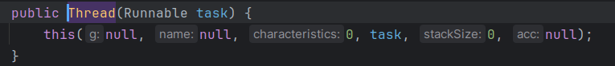

# Threads

## O que uma Thread?

Tem duas definições no java.

1. um Objeto. Porque podemos instanciar a classe Thread
2. E a melhor definição, que é: `uma linha de execução`.

Podemos abstrair threads, como trabalhadores que dividem a carga dos processos computacionais.

É possivel ver isso no gerencidaor de tarefas do sistema operacional, por exemplo, o do Windows, onde mostra quantos processos estão rodando de quantas threads estão sendo usadas. Porém, não é possível ver essa divisão de quantas threads estão sendo usadas para cada serviço, isso já é uma tarefa de muito baixo nível.
<br>
Inclusive, no Java assim como ver essas divisões, há muitas coisas que não tem muito como mecher relacionado as threads. Na maioria das vezes, a JVM faz o que ele quer, e a gente, no máximo, da algumas "sugestões" do que queremos que ele faça e como...

----------

Em nossas máquinas, temos os núcleos da CPU, também chamado de `Cores`, que na verdade são os próprios processadores, enquanto o que chamamos de CPU ou processador na verdade é uma unidade de processadores.

Vamos supor que em nossa CPU temos 4 núcleos. Geralmente a CPU tem o de threads, o dobro de núcleos, no gerenciador de tarefas do windows, aparece como processadores logicos, porém também temos threads virtuais, que são nada menos que as divisoes de tarefas para o processador ou para as threads "de verdade" ou "nativas".

Quando rodamos:

```java
System.out.println(Runtime.getRuntime().availableProcessors());
```

Nos retorna a quantidade de Threads **nativas** do pc (Ou pelo menos as que estão disponíveis).

----------

#### Nesse curso não será o foco a abordagem de threads nativas, mas sim sobre as virtuais, ou os "*trabalhadores*".

É necessário saber o seguinte de threads:

existem dois tipos de threads (ao menos no java, não sei no SO em geral).

- Daemon
- User

o programa "termina" quando todas as threads de tipo User são finalizadas independente se tem threads de tipo Daemon rodando, pois são de mais baixa prioridade, as threads de tipo Daemon, são as que cuidam de partes do programa como Garbage collector, por exemplo.

## Vamos ver como trabalhar manualmente com threads

Todo programa tem uma thread, e toda thread tem um nome, podemos pegar o nome da threa rodando `System.out.println(Thread.currentThread().getName());`. não é por conta do método, mas por que é esse o nome da thread que executa os programas Java.

----------

Não é a forma mais recomendada mais podemos criar uma thread extendendo a classe `Thread`:

```java
class ThreadExample extends Thread {
    private char c;

    public ThreadExample(char c) {
        this.c = c;
    }

    // o método run não é nada menos que o que a thread fará
    // no nosso caso ela vai 1 - printar o próprio nome
    // iterar de 0 até 500 printando um char e vai pular uma linha quando o valor de i % 100 for 0
    @Override
    public void run() {
        System.out.println(Thread.currentThread().getName());
        for (int i = 0; i < 500; i++) {
            System.out.print(c);
            if (i % 100 == 0) {
                System.out.println();
            }
        }
        System.out.println('\n');
    }
}
```

Rodando o seguinte código vamos perceber que o método de cada instância será o nome da mesma threa que inicia as aplicações do java (main), pois não foi criada uma nova thread para cada instância.

```java
    public static void main(String[] args) {
        ThreadExample t1 = new ThreadExample('A');
        ThreadExample t2 = new ThreadExample('B');
        ThreadExample t3 = new ThreadExample('C');
        ThreadExample t4 = new ThreadExample('D');

        t1.run();
        t2.run();
        t3.run();
        t4.run();
    }
```

Pra criar uma thread para cada instância, é necessário chamar o método `start()` ao invés de `run()`. Fazendo isso você pode perceber que realmente fez sentido quando eu disse que as threads criadas pelo java são gerenciadas da forma que a JVM quiser. observe na imagem abaixo como a ordem de execução de cada thread foi bagunçada depois de executar o código acima substituindo `run` por `start`:


----------

Bem, vamos ver a forma menos errada de criar uma thread no java, como falei acima, extender a classe thread não é tão interessante pois a extenção de uma classe é mais pra quando a classe trata de uma especificação, o que não é nosso caso. Logo, devemos implementar a interface `Runnable` e colocar o mesmo código na classe. pra executar, fica dessa forma:

```java
        // a instância será do tipo Thread e passamos a nossa classe que implementamos `Runnable` dentro do construtor, afinal é um obj Runnable que o construtor de uma Thread recebe...
        Thread t1 = new Thread(new ThreadExampleRunnable('A'));
        Thread t2 = new Thread(new ThreadExampleRunnable('B'));
        Thread t3 = new Thread(new ThreadExampleRunnable('C'));
        Thread t4 = new Thread(new ThreadExampleRunnable('D'));
        
        t1.start();
        t2.start();
        t3.start();
        t4.start();
```

