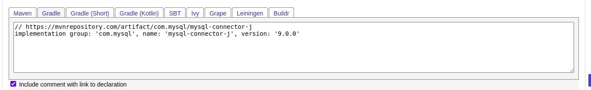
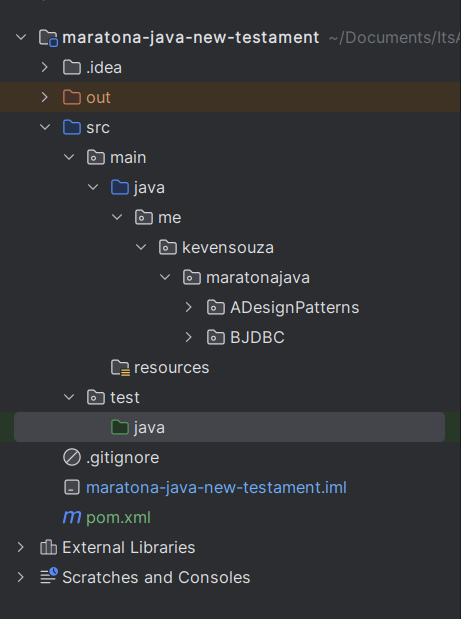
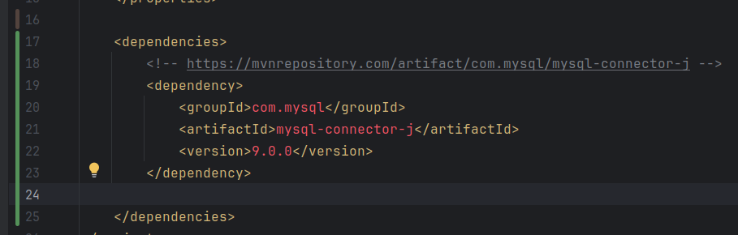
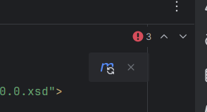
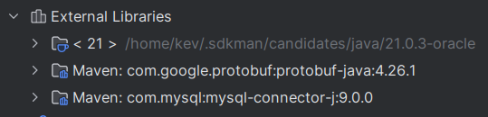
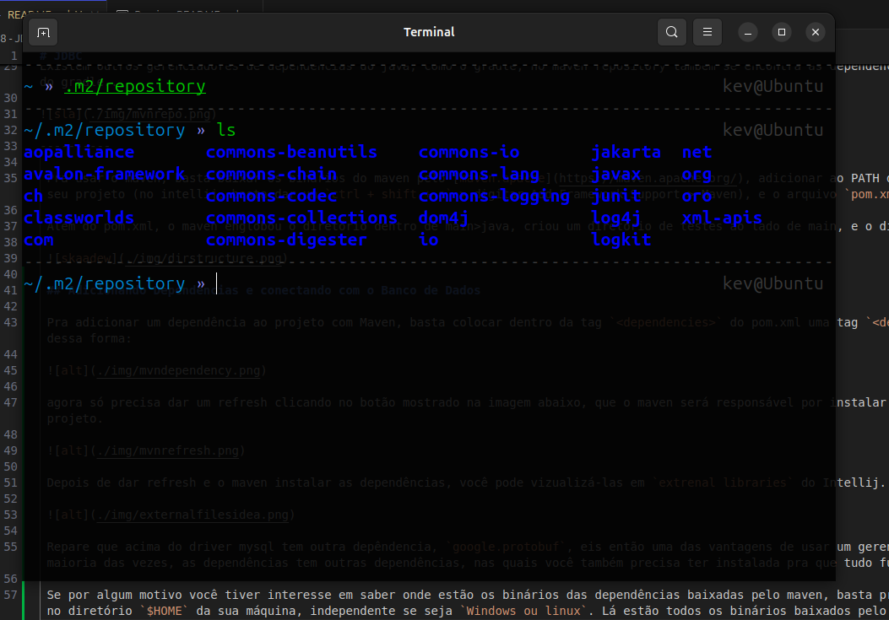

# JDBC

[JDBC](../maratona-java-new-testament/src/me/kevensouza/maratonajava/BJDBC/)

JDBC `(Java Database Connectivity)` é uma biblioteca de conexão de baco de dados com o Java. Levando em consideração de que temos varios SGBDs (Sistemas gerenciadores de bancos de dados), a equipe de desenvolvimento do java, em certo momento decidiu criar uma interface com intuito de padronizar a conectividade, dessa forma, cada organização responsável pelos SGBDs vão criar os conectores a partir da interface do JDBC.

Então basicamente, o java tem um pacote `java.sql` onde tem as seguintes interfaces: `(Connection, Statement, ResultSet, DriverManager)`. Inspecionando a class Connection há alguns métodos onde cada banco de dados implementa uma forma de conexão (também chamado de `Driver`) em cima dos métodos.

----------

Ok, já cientes de que há uma padrão de conectividade com banco de dados no java. Como podemos fazer a conexão com um banco de dados a partir do seu driver?

1. Bom, é possível baixar o binário do driver pela web, na documentação do banco de dados, como um mysql da vida. Mas esse é o jeito mais arcaico possível. porquê se você está usando uma versão desatualizada do driver, vc teria que baixar a versão atualizada e conectar. enquanto da outra forma...
2. [...] Usando um gerenciador de dependências do java, como o Maven. Você só precisaria adicionar algumas linhas de código no arquivo de dependencias e dar um "refresh" pra trocar a versão do driver.

----------

Pra adicionar uma dependência ao projeto usando maven, basta pesquisar por essa dependência no [Maven Repository](http://mvnrepository.com), procurar a versão desejada, copiar o código e colar no arquivo de dependências.

```
<!-- https://mvnrepository.com/artifact/com.mysql/mysql-connector-j -->
<dependency>
    <groupId>com.mysql</groupId>
    <artifactId>mysql-connector-j</artifactId>
    <version>9.0.0</version>
</dependency>
```

Existem outros gerenciadores de dependencias do java, como o gradle, no maven repository também se encontra as dependencias no formato do arquivo de dependencias do gradle...



----------

 Pra usar o maven, basta baixar os binários do maven pelo [maven.apache](https://maven.apache.org/), adicionar ao PATH do seu OS e adicionar o suporte maven no seu projeto (no intellij, basta dar um `ctrl + shift + a` > digitar Add Framework Support > Maven), e o arquivo `pom.xml` será criado.

 Além do pom.xml, o maven englobou o diretório dentro de main>java, criou um diretório de testes ao lado de main, e o diretório resources ao lado de java, veja:

 

 ## Adicionando Dependencias e conectando com o Banco de Dados

 Pra adicionar um dependência ao projeto com Maven, basta colocar dentro da tag `<dependencies>` do pom.xml uma tag `<dependency>` correspondente a dependência, dessa forma:

 

 agora só precisa dar um refresh clicando no botão mostrado na imagem abaixo, que o maven será responsável por instalar as dependências do pom.xml para dentro do projeto.

 

 Depois de dar refresh e o maven instalar as dependências, você pode vizualizá-las em `extrenal libraries` do Intellij.

 

 Repare que acima do driver mysql tem outra depêndencia, `google.protobuf`, eis então uma das vantagens de usar um gerenciador de dependencias no projeto. Na maioria das vezes, as dependências tem outras dependências, nas quais você também precisa ter instalada pra que tudo funcione como esperado.

 Se por algum motivo você tiver interesse em saber onde estão os binários das dependências baixadas pelo maven, basta procurar pelo diretório `.m2`, localizado no diretório `$HOME` da sua máquina, independente se seja `Windows ou linux`. Lá estão todos os binários baixados pelo Maven em todos os projetos onde ele foi usado.

 

 ----------
 
 Beleza, agora vamos nos conectar com um banco de dados mysql, com o driver que instalamos com o Maven.

A forma mais simples de se conectar com o mysql é chamando o método `getConnection()` da classe `DriverManager`, fornecer o username e a senha do banco de dados, e uma URL que pode variar dependendo do banco de dados. no caso do mysql, a URL segue esse padrão: `jdbc:mysql://{HOST}:{PORT}/{DATABASE}`. Por fim, basta encapsular o método em um bloco TryCatch e Voilà...

```java
public class Main {
    public static void main(String[] args) {
        try {
            DriverManager.getConnection(
                    "jdbc:mysql://localhost:3306/anime_store",
                    "kev",
                    Dotenv.load().get("DB_PASSWORD")
            );
        } catch (SQLException e) {
            throw new RuntimeException(e);
        }
    }
}
```